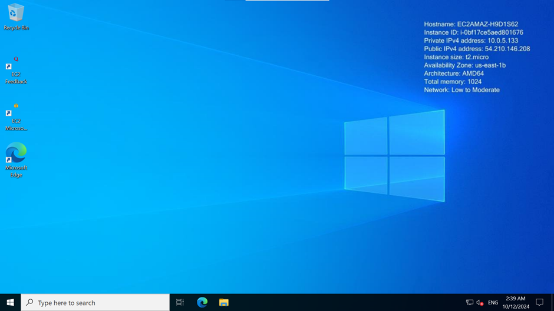

# Task

Set up a Windows Server environment and install the required software, including Docker and Git. Document your setup process.

# Implementation

This task can be performed on your local computer on a cloud platform like AWS, Azure, Google cloud, digital ocean etc, however I decided to use the AWS cloud platform as AWS is widely used in the industry and using it instead of VMWare or Virtualbox demonstrates real-world skills.

Since automation is the foundation of DevOps, I made the decision to automate this configuration using Terraform for Infrastructure as Code. Writing reusable code excites me particularly since it improves consistency, scalability, and process efficiency. Teams can work more productively when infrastructure can be automated, and I get great satisfaction from developing solutions that increase productivity while preserving flexibility for unforeseen circumstances.

## Terraform Script

The Windows server will be setup in an EC2 instance in AWS, the EC2 instance will be located in a virtual private cloud (VPC) network on AWS and I decided against using the default VPC opting to create my own project specific VPC using the AWS VPC module.

The decision to leverage on an existing module is owing to the fact that the module is tested, maintained, and reliable and so there isn't any need to reinvent the wheel for such a low level task such as VPC creation.

I also used an S3 bucket and DynamoDb table to save my state file and lock file respectively. I made the decision to manually create my bucket and table via the management console in order to circumvent the two step creation process that would have been required were I to use the same Terraform script to create them where I will use them.

### Provider Configuration

To begin, I wrote the configuration for the provider and added my backend configuration. The code for that is seen below:

```hcl
# Add provider
terraform {
  required_providers {
    aws = {
      source  = "hashicorp/aws"
    }
  }

  # Backend configuration
  backend "s3" {
    bucket         = "mantix-assessment-statefile"
    key            = "mantix/terraform.tfstate"
    region         = "us-east-1"
    dynamodb_table = "mantix-assessment-lockfile"
  }
}


# Configure the AWS Provider
provider "aws" {
  region = var.region
  shared_credentials_files = ["~/.aws/credentials"]
}
```

### Create VPC 

As I already mentioned, I made use of the [AWS VPC Module](https://registry.terraform.io/modules/terraform-aws-modules/vpc/aws/latest) in the creation of my VPC. 

Calling the module, I added all the necessary parameters.

### Create Security group

After the VPC configuration, I wrote the configuration for my EC2 security group. My security group allowed RDP and HTTP traffic into the server.

Since I knew I was going to use Ansible for the configuration of the server, I also whitelisted the WimRm ports so that Ansible can connect to the server. I did this by adding ingress rules for port 5985 and 5986 which are the default ports of WimRm.

### Create Windows Server

Finally I created the windows server using the `aws_instance` resource. 

I used the data block to retrieve the ami of the windows 2022 server and also to retrieve an existing key pair from my AWS account.

I decided to use an existing key pair and not create the key pair directly in terraform using the `tls_private_key` resource for security purposes. The latter will cause the private key to become a part of the terraform state and create a potential of it being exposed. Whereas the formal ensures that my private key is not a part of the Terraform state file.

## Connect to the server

When the server was up and running to test my setup I connected to the server using Remote Desktop Connection.

I retrieve the public IP from the output of my terraform run and decrypted the password using the private key of my key pair, along with the username I was able to connect to the server.


The image below, shows a success connection.



## Install Required Software

For a more granular control over the installation and configuration of the required software I opted to use Ansible for my server configuration instead of the `user_data` argument of terraform.

While Terraform is excellent for provisioning infrastructure, Ansible excels in managing the configuration and software installation on that infrastructure.

I made use of the Dynamic inventory feature of Ansible which allows you to automatically gather and manage hosts from various sources, such as cloud providers, databases, or other custom scripts.

I filtered with instance-state-name and platform, to ensure I only included hosts that were windows based and were running.

Here is what my dynamic inventory script looked like:

```yml
plugin: aws_ec2 # Use the ansible built-in dynamic inventory plugin for EC2
regions:
  - us-east-1      # Specify the region(s) you want to use
filters:
  instance-state-name: running  # Only include running instances
  platform: windows              # Filter for Windows instances
```

To test that the dynamic inventory was getting the required hosts I tested it using the below command and from the screenshot below you can see that it successfully pulled my hosts from AWS.

```sh
ansible-inventory -i windows.aws_ec2.yaml --graph
```

### Host Requirements

For Ansible to communicate with a Windows host and use Windows modules, the Windows host must meet these base requirements for connectivity:

- With Ansible you can generally manage Windows versions under the current and extended support from Microsoft. You can also manage desktop OSs including Windows 10 and 11, and server OSs including Windows Server 2016, 2019, and 2022.

- You need to install PowerShell 5.1 or newer and at least .NET 4.0 on the Windows host.

- You need to create and activate a WinRM listener.

I was able to verify that my windows server had the required Powershell and .NET Framework versions but I still need to setup the WimRM listener.

### Setup Host to Accept Ansible Connection

The below are the steps I took to configure HTTPS listener in windows.

```powershell
winrm e winrm/config/Listener
```

I had only the HTTP listener so I configured an HTTPS listener

#### Steps I took to Configure Listener on the Windows Server

- I created a self signed certificate and stored the certificate in the LocalMachine\My certificate store of the Windows server.

- Once the certificate was created and stored I then created my HTTPS Listener using the Thumbprint from the certificate.

- The next thing I did was to add a new firewall rule so that the windows server firewall does not block the configured WinRM listener ports.

- The next step was to set the service for basic authentication to `True` on Windows server. This step was necessary in order to ensure that my authentication from Ansible to the Windows server is not to be rejected.

- The last step for the windows server configuration was to verify that my listener was created and the basic authentication service was set to true.

### Configure Ansible

Since I have already setup my inventory using Ansible's dynamic inventory feature, I created a file to save the necessary variables that will allow Ansible connect with the windows server.

I created a `group_vars` directory with an `aws_ec2.yaml` file and added the below variable to it

```yml
ansible_user: Administrator
ansible_password: "<password>"
ansible_port: 5986
ansible_connection: winrm
ansible_winrm_scheme: https
ansible_winrm_server_cert_validation: ignore
ansible_winrm_transport: ssl
```

This allowed me connect to my server from ansible, I tested the connection using the below command:

```sh
ansible -i windows.aws_ec2.yaml aws_ec2 -m win_ping
```

From the screenshot below, you can see that the connection was established

(image 7.ansible-pong.png)

### Ansible Playbook to Install Software

#### Steps
- I started by installing Critical and Security Updates using the `win_updates` module.

- Next I installed Chocolatey using the `win_chocolatey` module to install Chocolatey. This is a necessary step as I will be using the `win_chocolatey` module for my installations.

- I then went ahead and installed Chocolatey Packages, since there are quite a number of packages to install I looped through the installation for simplicity. I used the `win_chocolatey` module to install the following:
    - Node.js
    - Git
    - Python 3
    - Visual Studio Code
    - Docker Desktop
    - MySQL
    - PostgreSQL

-  My next installation was the IIS (Internet Information Services) using the `win_feature` module again to install the IIS web server and its management tools. I registered the installation so I can use it to store the result of the task in a variable. This was done to capture the output (status, result, and any other relevant data) of the task and use that output in subsequent tasks.

- I checked if a reboot is required after the IIS installation and performed it if necessary.

- My next installation was the IIS Management Console.

- Then the installation of the System Center and checking for required reboots.

- I also installed Windows Admin Center:

- Finally I installed Windows Defender and checked for required reboots.