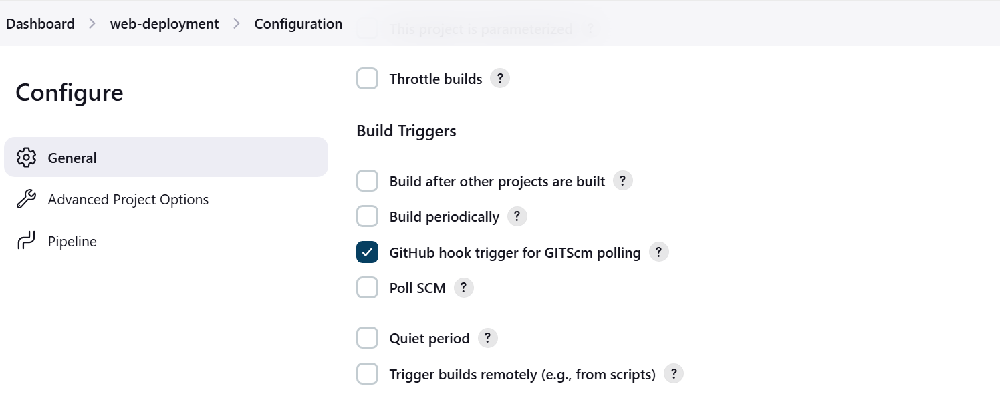
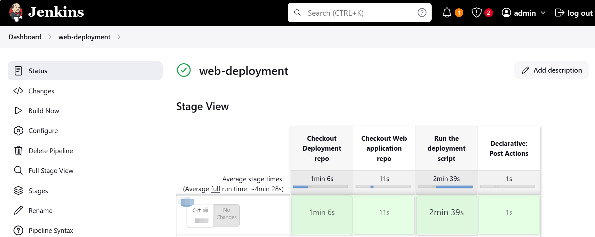

# Task

Set up a Jenkins CI/CD pipeline that pulls the web application from GitHub and triggers the deployment script upon each commit.

# Implementation

We were already provided the Jenkins file to use and so I downloaded the application first.

## Installation Process

- First I installed Java Development Kit (JDK) version 23 but while installing Jenkins I realised that the JDK version required were either version 11, 17 or 21 and so I had to uninstall the version 23 and install version 21.

- I configured the Windows server to allow my user the ability to logon as a service, from previous experience I know that this is a required setting and so I did this before beginning the Jenkins installation.

-  Steps for the above include: 
    > Administrative tools &rarr; Local Security Policy &rarr; User Rights Assignment &rarr; right click on Log on as a service and choose properties &rarr; Click on the Add User or Group &rarr; enter the username you wish to add in the Select Users or Groups dialogue &rarr; click ok.

- I then went ahead to install my Jenkins following the onscreen instructions of the MSI installer.

## Configure Jenkins

This was a simple pipeline as the bulk of the work is already done by the script.

All I need to do was to setup a pipeline that checkouts but the Deployment github repo (this particular repo) and the Web application repo which holds our web application files.

After checking out the repo, the pipeline will then run the script to deploy the web application.

Also the pipeline should be triggered by every push to any of these repos and for this I added webhooks to the respective repos.

### Configuring Webhook

These are the steps I took to add the webhook to the github repos.

- First in Jenkins, in the pipeline configuration under `Build Trigger`, I checked the `Github hook trigger for GITScm polling` as shown below:

- Next I headed to Github and in the repo settings I clicked on `webhooks` and then `add webhook`.

- I retrieved the payload url from jenkins `Manage Jenkins &rarr; Configure System &rarr; GitHub` and entered it in the provided section.

- I chose the `application/json` content type and chose the trigger event to be just on the push event.

### Configure pipeline

- I wrote my pipeline in groovy using the logic I explained earlier. Check out repos, run script and use the post section to define success or failure of the pipeline run at the end of the pipeline.

- The most significant thing is that I added an environment variable for the github repo as the script is expecting either a user input of an environment variable with the value of the web application repo.

- I added this as an environment in my pipeline, you can see it in the JenkinsFile.

Below is a snapshot of the successful ci/cd run

